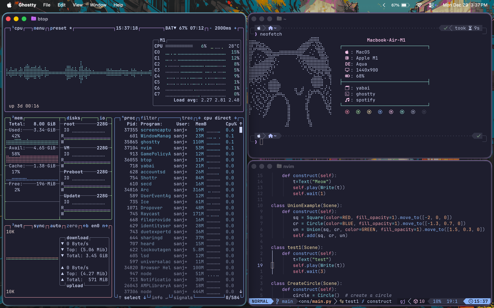

# MacOS Dotfiles

Custom zsh, Neovim, and shader configurations for macOS Tahoe.

  
## Dependencies
**Core Packages:** 
/bin/bash -c "$(curl -fsSL https://raw.githubusercontent.com/Homebrew/install/HEAD/install.sh)(Homebrew) 
brew install zsh neovim git ripgrep fd fzf 
brew install –cask font-fira-code-nerd-font 
brew install yabai skhd kitty lazygit 
brew install borders 
curl -fsSL https://raw.githubusercontent.com/spicetify/cli/main/install.sh | sh 
brew install btop 
brew install cava 
raycast, shotrr, altTab(optional) 
brew install ghostty iterm2 
python 
lazyvim 
brew install luarocks 
brew install powerlevel10k 
brew install tree-sitter tree-sitter-cli 

